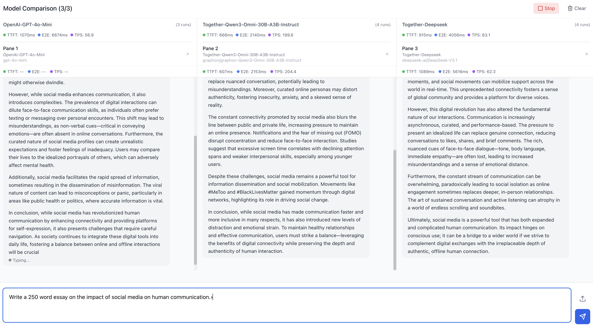

# Together Chat

A modern, full-stack chat application for interacting with Large Language Models (LLMs) through various API endpoints. Built with React frontend and Node.js backend.



## Features

### Core Features
- **Multi-Endpoint Support**: Configure multiple LLM endpoints (OpenAI, Anthropic, local models, etc.)
- **Streaming Responses**: Real-time streaming chat completions
- **Chat History Management**: Toggle chat history on/off per conversation
- **Multimodal Support**: Upload and send images along with text messages
- **Session Management**: Create, manage, and delete chat sessions
- **Persistent Data**: SQLite database for storing endpoints, sessions, and chat history

### User Interface
- **Elegant Design**: Clean, minimalistic interface with smooth animations
- **Auto-scroll**: Messages automatically scroll into view
- **Responsive Layout**: Works well on desktop and mobile devices
- **Real-time Feedback**: Loading indicators and streaming status

### Endpoint Configuration
- **Base URL**: Configure custom API endpoints
- **API Key Management**: Secure API key storage
- **Model Selection**: Choose specific models for each endpoint
- **System Prompts**: Set custom system prompts per endpoint
- **Temperature Control**: Fine-tune response creativity (0.0 - 2.0)

## Technology Stack

### Backend
- **Node.js** with Express.js
- **SQLite** for data persistence
- **Multer** for file uploads
- **Axios** for HTTP requests
- **CORS** enabled for cross-origin requests

### Frontend
- **React 18** with modern hooks
- **Vite** for fast development and building
- **Tailwind CSS** for styling
- **Lucide React** for icons
- **Axios** for API communication

## Installation

### Prerequisites
- Node.js (v18 or higher)
- npm or yarn package manager

### Quick Start

1. **Clone the repository**
   ```bash
   git clone <repository-url>
   cd chat-client
   ```

2. **Install dependencies**
   ```bash
   npm install
   ```

3. **Start the development servers**
   ```bash
   npm run dev
   ```

   This will start both the backend server (port 3001) and frontend development server (port 3000).

### Manual Setup

If you prefer to set up backend and frontend separately:

#### Backend Setup
```bash
cd backend
npm install
npm run dev
```

#### Frontend Setup
```bash
cd frontend
npm install
npm run dev
```

## Usage

### 1. Configure Endpoints

1. Click the settings icon in the sidebar to open the Endpoint Manager
2. Click "Add New Endpoint" to create your first endpoint
3. Fill in the required information:
   - **Name**: A friendly name for your endpoint
   - **Base URL**: The API base URL (e.g., `https://api.openai.com/v1`)
   - **API Key**: Your API key for the service
   - **Model**: The model name (e.g., `gpt-4o`, `claude-3-sonnet`)
   - **System Prompt**: (Optional) Custom system instructions
   - **Temperature**: Response creativity level (0.0 - 2.0)

### 2. Start Chatting

1. Select an endpoint from the dropdown in the sidebar
2. Click "New Chat" to create a chat session
3. Type your message in the input field at the bottom
4. Click the image icon to upload images for multimodal conversations
5. Press Enter or click Send to submit your message

### 3. Manage Chat History

- Use the toggle switch in the chat header to enable/disable chat history
- When enabled, the full conversation context is sent with each message
- When disabled, each message is sent independently without previous context

### 4. Session Management

- View all your chat sessions in the sidebar
- Click on any session to continue the conversation
- Click the trash icon to delete unwanted sessions

## API Endpoints

The backend provides the following REST API endpoints:

### Endpoints Management
- `GET /api/endpoints` - List all endpoints
- `POST /api/endpoints` - Create new endpoint
- `PUT /api/endpoints/:id` - Update endpoint
- `DELETE /api/endpoints/:id` - Delete endpoint

### Session Management
- `GET /api/sessions` - List all chat sessions
- `POST /api/sessions` - Create new session
- `DELETE /api/sessions/:id` - Delete session
- `GET /api/sessions/:sessionId/messages` - Get session messages

### Chat & Media
- `POST /api/chat` - Send message and receive streaming response
- `POST /api/upload` - Upload image file

## Configuration

### Environment Variables

You can set the following environment variables:

#### Backend (.env in backend folder)
```
PORT=3001
```

#### Frontend (.env in frontend folder)
```
VITE_API_URL=http://localhost:3001/api
```

### Database

The application uses SQLite for data persistence. The database file (`chat.db`) is automatically created in the backend directory on first run. The schema includes:

- **endpoints**: Store API endpoint configurations
- **chat_sessions**: Store chat session metadata
- **chat_messages**: Store individual messages with support for images

## Development

### Project Structure
```
chat-client/
├── backend/
│   ├── server.js          # Main server file
│   ├── package.json       # Backend dependencies
│   ├── uploads/           # Image upload directory
│   └── chat.db           # SQLite database (auto-created)
├── frontend/
│   ├── src/
│   │   ├── components/    # React components
│   │   ├── services/      # API service functions
│   │   ├── App.jsx        # Main app component
│   │   └── main.jsx       # React entry point
│   ├── package.json       # Frontend dependencies
│   └── vite.config.js     # Vite configuration
└── package.json          # Root package.json with scripts
```

### Building for Production

1. **Build the frontend**
   ```bash
   cd frontend
   npm run build
   ```

2. **Start the production server**
   ```bash
   cd backend
   npm start
   ```

   The built frontend files will be served by the backend server.

## Supported LLM Providers

This client works with any OpenAI-compatible API, including:

- **OpenAI** (GPT-4, GPT-3.5)
- **Anthropic Claude** (via compatible proxies)
- **Local models** (Ollama, LM Studio, etc.)
- **Azure OpenAI**
- **Custom API endpoints**

## Contributing

1. Fork the repository
2. Create a feature branch
3. Make your changes
4. Test thoroughly
5. Submit a pull request

## License
This project is licensed under the MIT License - see the [LICENSE](LICENSE) file for details.

## Troubleshooting

If you encounter any issues or have questions:

1. Check the browser console for error messages
2. Verify your API endpoints and keys are correct
3. Ensure both backend and frontend servers are running
4. Check network connectivity to your LLM provider
